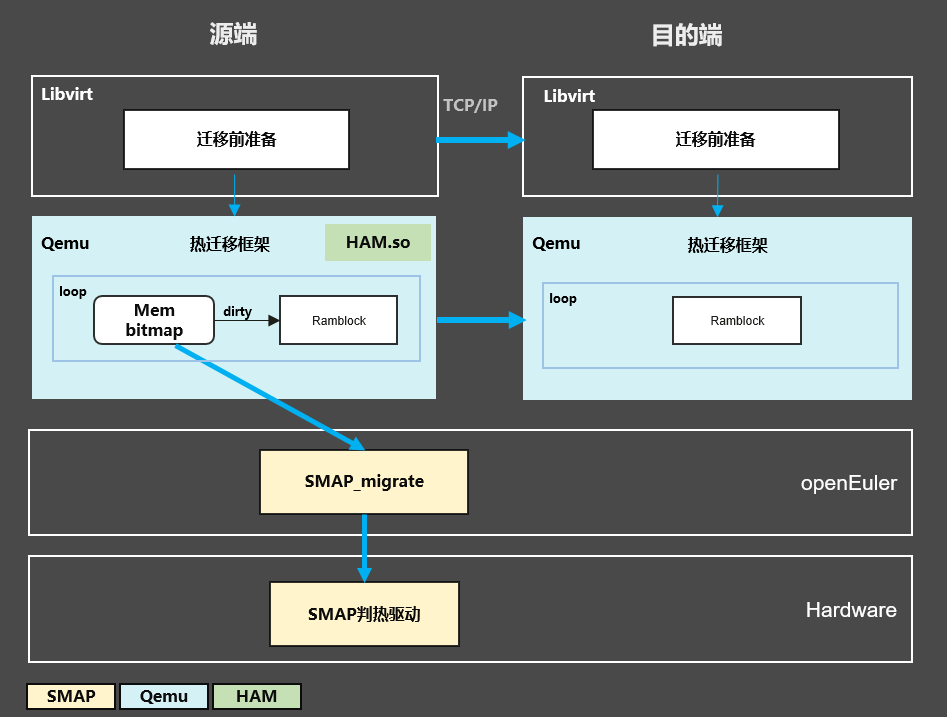

## 项目介绍

**HAM：High-Availability Migration**，高可用性热迁移服务，基于灵衢总线的远端内存访问能力与大带宽，实现确定性时长的虚机热迁移，解决计划内停机问题，实现系统高可用.

## 项目架构

## 应用适配方式

- **组件依赖**：依赖obmm内存借用能力及smap冷热识别、页面迁移能力
- **轻量化部署**：插件安装完成无需配置即可使用

## 交付件类型

| 交付件类型 | 规范                                                                                                                           |
|-------|------------------------------------------------------------------------------------------------------------------------------|
| RPM版本 | 遵循[openEuler社区规范](https://gitee.com/openeuler/community/blob/master/zh/contributors/packaging.md)，以**Major.minor.patch**管理版本 |
| RPM命名 | ham-libs-0.0.1.aarch64.rpm                                                                                                   |
| so命名  | libham.so                                                                                                                    |
| ko命名  | 无                                                                                                                            |
| 代码仓   | openEuler/ham                                                                                                             |

## 如何贡献代码

1.  Fork 本仓库
2.  新建 Feat_xxx 分支
3.  提交代码
4.  新建 Pull Request

### 开发指导
详细的开发指导请参考[HAM Tutorial](doc/Developer_Tutorial.md)

## 联系我们
针对我们的项目，在开发、使用过程中，如果有任何的意见、建议、问题，可以参考如下：

- 创建issue: xxx
- 联系我们：xxx