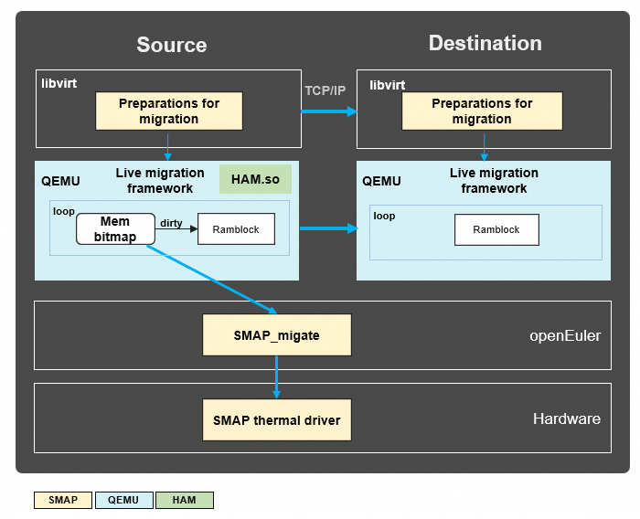

# Project Overview

**High-Availability Migration (HAM)**: Based on the remote memory access capability and high bandwidth of UnifiedBus, HAM implements VM live migration with deterministic duration, solving the problem of planned downtime to ensure high system availability.

## Project Architecture

## Application Adaptation Method

- **Component dependency:** HAM depends on the OBMM memory borrowing capability and SMAP cold and hot identification and page migration capabilities.
- **Lightweight deployment:** HAM is installed using a plugin without configuration after installation.

## Deliverable

| Deliverable| Standard                                                                                                                          |
|-------|------------------------------------------------------------------------------------------------------------------------------|
| RPM package version| Complies with the [openEuler community specifications](https://gitee.com/openeuler/community/blob/master/en/contributors/packaging.md) and uses <code>Major.minor.patch</code> to manage versions.|
| RPM name| <code>ham-libs-0.0.1.aarch64.rpm</code>                                                                                                  |
| SO file name | <code>libham.so</code>                                                                                                                   |
| KO name | None                                                                                                                           |
| Code repository  | openEuler/ham                                                                                                             |

## How to Contribute Code

1. Fork this repository.
2. Create a Feat_*xxx* branch.
3. Commit code.
4. Create a pull request (PR).

### Development Guide

For detailed development instructions, see [HAM Tutorial](doc/Developer_Tutorial.md).

## Contact Us

If you have any comments, suggestions, or questions during the development and use of our project, you can:

- Create an issue: xxx.
- Contact us: xxx.
