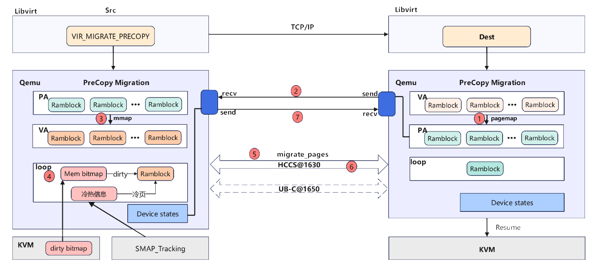

# Summary
总结性描述：
- 确定性虚机热迁移基于灵衢内存池化能力将目的端虚机内存上线到源端os，并利用内核migrate_pages接口迁移内存，期间通过灵衢总线远端内存访问能力保活虚机；迁移中虚机数据无副本，可去除迭代清脏依赖，以实现确定性时长迁移；
- 针对计划内停机场景（如软硬件升级，故障预测触发的维护动作，以及例行硬件维护等），服务器需要在确定时间内停机维护，并在保证虚机完整性的前提下降低业务中断时间。当前虚机热迁移方案整体迁移时间不可控，与确定性的停机维护动作存在冲突，基于此，设计HAM(High-Availability Migration)组件；
- 作为QEMU插件，提供确定性迁移功能

# Usage Example
可以给出此模块如何使用（可超链接过去）
- API文档 : [链接](api_docs_reference.md)
- 部署文档 ：[链接](User_Guide.md)

# Movitvation
基于灵衢总线的远端内存访问能力与大带宽，实现确定性时长的虚机热迁移，解决计划内停机问题，实现系统高可用。

确定性虚机热迁移基于灵衢内存池化能力将目的端虚机内存上线到源端os，并利用内核migrate_pages接口迁移内存，期间通过灵衢总线远端内存访问能力保活虚机；迁移中虚机数据无副本，可去除迭代清脏依赖，以实现确定性时长迁移；总体目标如下：
1. HAM插件化，同QEMU松耦合;
2. HAM插件为用户态so，主要负责：
   1. 迁移任务的启动控制，初始化相关管理资源；
   2. 页面迁移决策：基于采集的页面冷热信息，决策迁移的先后顺序；
3. HAM内核态部分集成为SMAP的一个子模块，主要负责：
   1. 页面管理，包括预申请静态大页、维护src_folio到dst_folio的映射关系、基于内核migrate_pages能力完成页面迁移；
   2. 数据一致性维护操作，包括改页表属性、刷Cache、UB排空等。

# Detailed Design

设计原理和方案

通过memcpy进行迭代拷贝，在停机阶段传输的脏页量是不确定的，为了解决这个问题，将拷贝方式从memcpy替换为migrate_pages, 将冷页迁移到目的端，源端虚机直接访问目的端内存页。

1. 获取目的端可迁移的ramblock信息
2. 基于qemu提供的单向send/recv方式，改进为双向send/recv方式, 并将目的端ramblock信息发送到源端
3. 交由obmm完成进程级内存借用
4. 进入迁移流程，通过kvm同步bitmap, 并查找其中脏页，同时根据smap_tracking获取到ramblock的冷热信息
5. 优先迁移脏页中的冷页：通过migrate_pages进行冷脏页迁移（优先传输最冷页，再次传输次冷页）
6. 传输方式在1650代际是UB-C总线
7. 页面迁移完成后，在停机阶段通过send语义发送设备状态

行为描述

具体流程
1. 通过openstack打开源端和目的端libvirt
2. 源端libvirt检查配置，生成迁移xml，并通过目的端libvirt做迁移准备
3. 开始迁移，依赖obmm完成进程级内存借用
4. 通过冷热信息模块获取页面冷热
5. 对待迁移页面按冷热排序，并通过migrate_pages接口之间进行迁移
6. 暂停虚机，发送残余页面和设备状态
7. 迁移流程结束，启动目的端虚机

# Design constraints

1. 虚拟机迁移目标节点与源节点属于同一个rack, 且为直连节点
2. 远端、目的端大页内存足够创建对应规格虚机
3. 迁移虚拟机规格小于256G
4. 虚拟机使用2M大页
5. 虚机内部numa数量为1，对应的RamBlock数量为1
6. 迁移过程中无其他应用抢占借用内存
7. 不支持并发迁移

# Adoption strategy
- 应用无需做特殊修改

# Related Documentions
不涉及

# SIGs/Maintianers
待补充